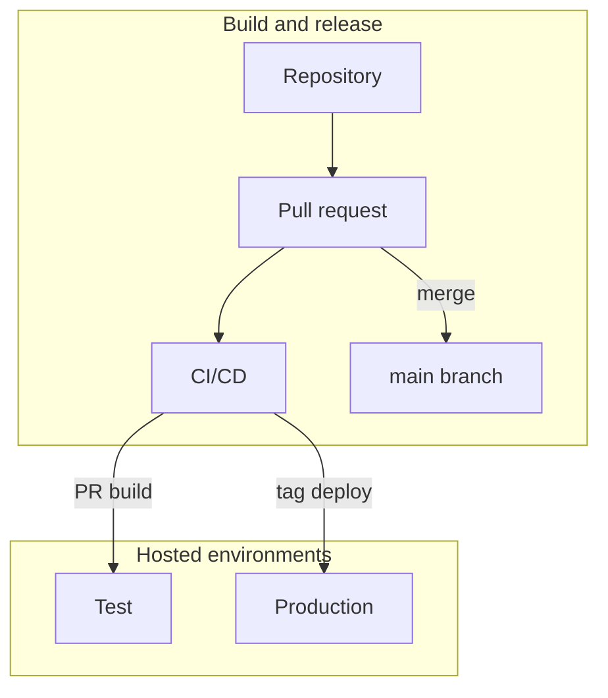

# Release flow

```mermaid
flowchart TB
    subgraph Delivery["Build and release"]
        Repo["Repository"] --> PR["Pull request"] --> CI["CI/CD"]
        PR -->|merge| Main["main branch"]
    end
    subgraph Hosted["Hosted environments"]
        Test["Test"]
        Prod["Production"]
    end
    CI -->|PR build| Test
    CI -->|tag deploy| Prod
```

Below is a diagram with an error.

```mermaid
flowchart LR
    A[[[ --> }}}
```

The end.
